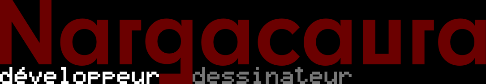
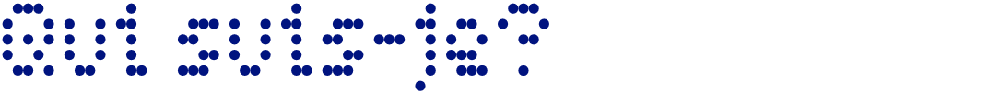
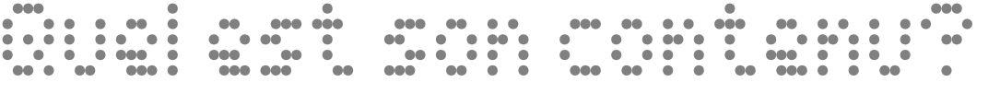
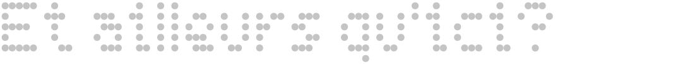

*Bienvenue sur mon git!*

De vrai nom **Damien Ledda**, je suis un jeune développeur (et dessinateur) habitant sur Strasbourg depuis mes premières secondes. Actuellement en formation de concepteur-développeur web PHP orienté objet à la CCI, le développement est un sujet qui me passionne depuis des années grâce au fait que les possibilités de création niveau software sont quasiment infinies. (Ah, et j'aime aussi jouer aux RPGs, dessiner -- duh --, regarder des médias incluant des kaiju... OK, je crois que j'ai trop dévié.)

Vous vous poserez probablement la question sur le contenu de ce Git. Eh bien, tout ce que j'ai pu faire depuis ma licence en termes de projets et aussi ce que je code(rai) en sites.

... Ah. Vous voulez avoir les spécifications, c'est vrai.
- Systèmes d'exploitation: **Windows**, **Linux**
- IDE: **VS Code** (depuis 2017), **Atom** (2016-2017)
- Langages: **C**, **PHP** (via **Symfony**), **CSS**, ... et plus encore! Enfin, sauf ce qui commence par "Pro" et se finit par "log".

Si vous vous demandez où *d'autre* vous pouvez me trouver, voici les réseaux auxquels je suis à l'heure actuelle:
- **[LinkedIn](https://www.linkedin.com/in/damien-ledda/)**: si vous voulez me contacter professionnellement (dans le cadre d'une prise de contact par exemple),
- **Discord**: si vous voulez discuter un peu (que ce soit professionnelement ou pas) [Le nom d'utilisateur est le même qu'ici]
- **[Twitter](https://twitter.com/Aurawushi)**: à la base pour les dessins, mais c'est plus du random depuis que je suis en hiatus

Voilà voilà. Ce Readme se mettra à jour en cas de changements.
