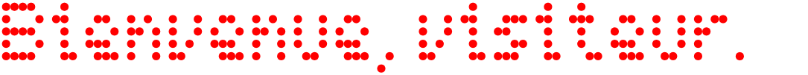
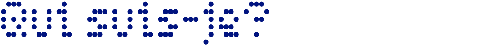
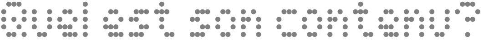
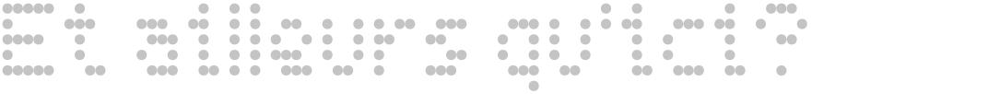

<!-- trunk-ignore(markdownlint/MD041) -->

De vrai nom **Damien Ledda**, je suis un jeune dev (et dessinateur quand l'envie m'y prend) habitant à Schiltigheim après avoir passé 24 ans sur Srasbourg. (Bon, 'kay, c'est pas loin, mais cherchons pas la 'tite bête.) Actuellement développeur logiciel dans une petite entreprise locale de développement de logiciels dédiés à la prise de rendez-vous, le code est un des sujets qui me passionnent depuis longtemps, certainement dû au fait que les possibilités de création niveau software sont quasiment infinies, et que la seule limite est celle de l'imagination, ce qui coincide avec celle du dessin. (Ah, et j'aime aussi jouer aux RPGs, regarder des médias incluant des kaijū et/ou des dragons... OK, je crois que j'ai trop dévié du but premier de cette présentation. Oops.)

Vous pouvez afficher ou télécharger le CV [ici](resources/pdf/CV.pdf) si ça vous chante. Bon, OK, il n'est pas totalement à jour, mais il le sera progressivement.

... Ah, c'est vrai. Vous voulez les spécif-- compétences.
| Systèmes d'exploitation | IDEs et outils utilisés | Langages | Frameworks | ORMs |
| :------------------------------------------------------------------------------------------------------: | :-------------------------------------------------------------------------------------------------------------------------------------: | :----------------------------------------------------------------------------------------------------------------------: | :---------------------: | :-------------------------------------------------------------------------------------------------------------------------: |
|  |  |  |  _(en cours)_ |  _(en cours)_ |
|  |  (la preuve, vous êtes ici) |  |  |
|  |  _(en cours)_ |  |  |
| | |  |  _(en cours)_ |
| | |  |
| | |  |

Vous vous demandez probablement ce qu'il y a dans ce Git. Eh bien, tout ce que j'ai pu coder (que ce soit en solo ou en équipe) depuis ma licence, hormis les codes provenant d'entreprises (qui sont propres aux orgas). Pour info, voici quelques stats:

_Note: Les stats de langages ne prennent pas en compte les répos des organisations auxquelles j'ai participé, d'où la grande différence entre le tableau et les stats._

Si vous vous demandez où _d'autre_ vous pouvez me trouver, voici les réseaux auxquels je suis à ce jour:

-  (même si je n'suis pas très actif là-bas)

-  (Pagotortoise#1826)
